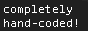
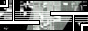
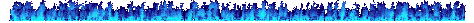
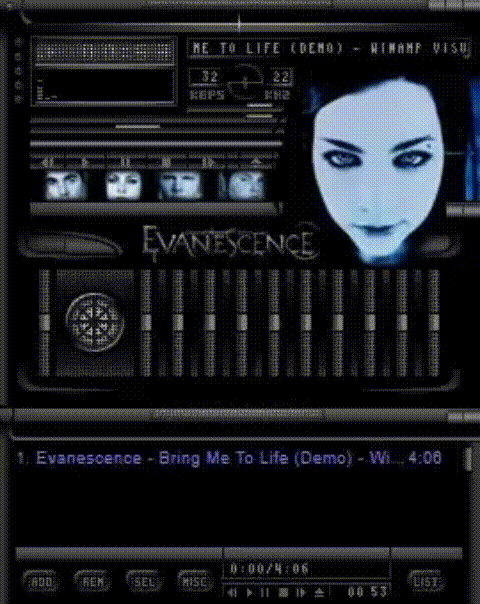
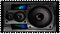

<div align="center">

# 


</div>
<div align="center">
          


</div>


# 
```txt
> whoami

Agustin Bowen
Systems Degree Student
24 years old
```
# 

  
   

# 

 

 

 


<div align="left">

   


</div>


